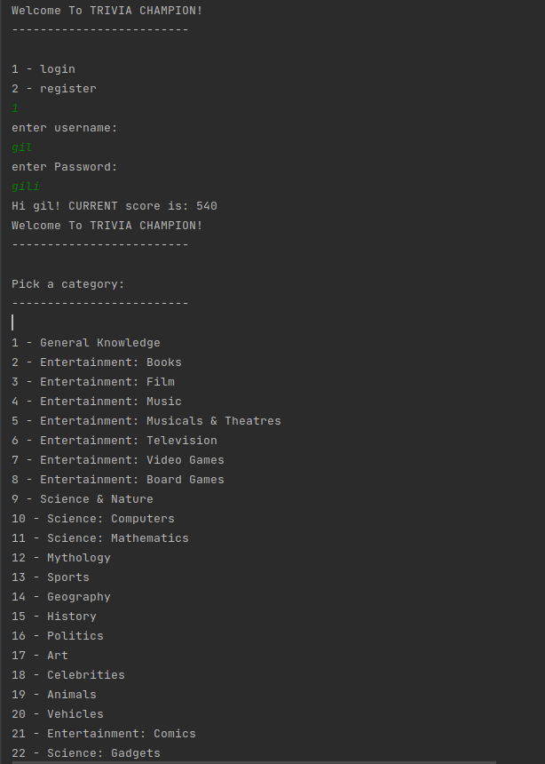

# Trivia
A OOP trivia game in cmd with sql DB and get the questions using API.

## About
I built a Trivia game that you tube a users DB for the scores and get the questions by asking the API of https://opentdb.com .
You will need to choose the category and difficulty and in the end of the game that score adds to your user score and also you will see the top 10 champions of the game.

## View:
The Game looks like:

## Links:
My GitHub project https://github.com/GilAvraham2909/Trivia

## Owners:
* Gil Avraham, Git: https://github.com/GilAvraham2909
* Niv , Gil: https://github.com/nivnis
